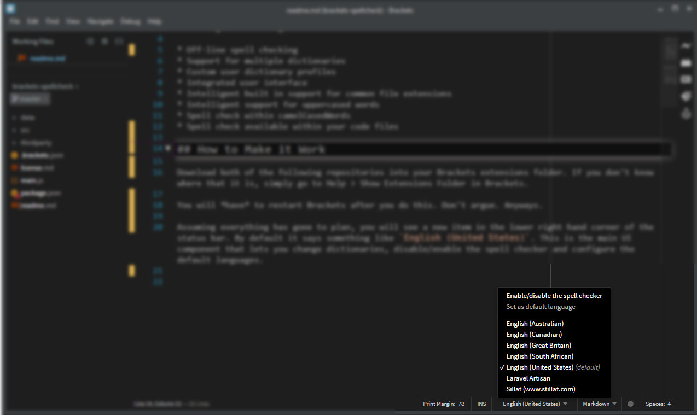
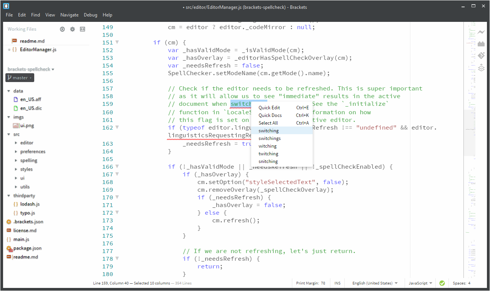

# Linguistics Brackets Extension

Linguistics adds a very powerful spell checking system to the Brackets editor. It offers the following features right out of the box:

* Off-line spell checking
* Support for multiple dictionaries
* Custom user dictionary profiles
* Integrated user interface
* Intelligent built in support for common file extensions
* Intelligent support for uppercased words
* Spell check within camelCasedWords
* Spell check available within your code files

## How to Make it Work

> For a detailed walkthrough, check out the guide on the [Stillat](https://stillat.com) website at [https://stillat.com/blog/2017/10/31/installing-linguistics-for-adobe-brackets](https://stillat.com/blog/2017/10/31/installing-linguistics-for-adobe-brackets)

Download both of the following repositories into your Brackets extensions folder. If you don't know where that it is, simply go to Help > Show Extensions Folder in Brackets.

* [`brackets/spellcheck`](https://github.com/JohnathonKoster/brackets-spellcheck)
* [`brackets-spellcheck-dictionaries`](https://github.com/JohnathonKoster/brackets-spellcheck-dictionaries)

You will *have* to restart Brackets after you do this.

Assuming everything has gone to plan, you will see a new item in the lower right hand corner of the status bar. By default it says something like `English (United States)`. This is the main UI component that lets you change dictionaries, disable/enable the spell checker and configure the default languages.

This looks like this:

Clicking on any of the dictionaries will reload them in real-time, no need to restart Brackets. Additionally, the plugin will *not* load a dictionary unless it actually needs to be used. A good example is if both the American and British English dictionaries are specified to load in a user profile, the extension will check the first dictionary, and if the word is spelled correctly it won't consult the second dictionary. Only when a word is flagged as misspelled by one dictionary will the extension start checking in other dictionaries.

The following image shows what it looks like when there are spelling errors. You can also right click on incorrect word to view suggestions and replace the word. There is currently no feature to add to dictionaries through the UI.

it is important to note that the spell checker will attempt to spell check your source code. It will even spell check the various words that make up a camelCased variable name. Give it a try, and if it is too much in your code you can disable it from the UI when working on source code.